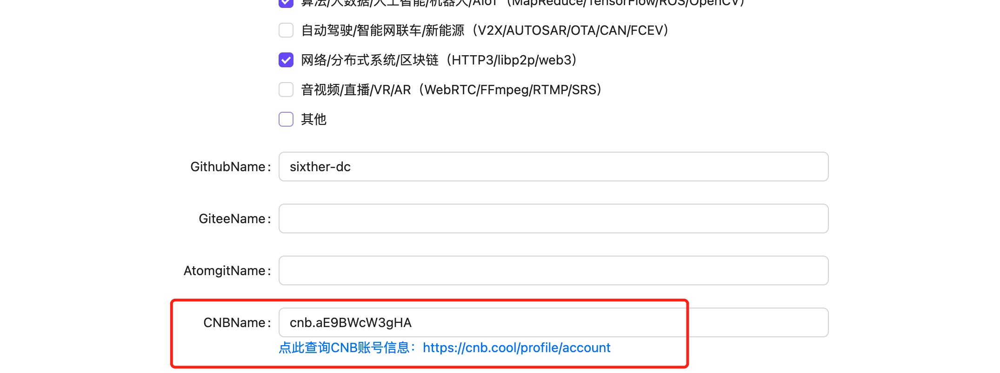

# C 语言训练营 Unit 3 — C Classicals

> 覆盖计算机科学 17 个子领域的经典问题——从操作系统死锁到量子计算，从密码学到计算机视觉，每道题都是该领域的"第一性原理"经典问题。

## 📚 练习题列表

49. [**49_dining-philosophers-sync** - 哲学家就餐问题 — Dining Philosophers](./exercises/49_dining-philosophers-sync/)
50. [**50_rdt-stop-and-wait** - 可靠数据传输 — Stop-and-Wait](./exercises/50_rdt-stop-and-wait/)
51. [**51_ll1-table-parser** - 表驱动 LL(1) 语法解析 — LL(1) Parser](./exercises/51_ll1-table-parser/)
52. [**52_bplus-tree-index** - B+ 树索引 — B+Tree Index](./exercises/52_bplus-tree-index/)
53. [**53_raytracer-from-scratch** - 基础光线追踪 — Ray Tracer](./exercises/53_raytracer-from-scratch/)
54. [**54_astar-pathfinding** - A*寻路算法 — A* Pathfinding](./exercises/54_astar-pathfinding/)
55. [**55_rsa-crypto-demo** - RSA 公钥加密 — RSA Cryptography](./exercises/55_rsa-crypto-demo/)
56. [**56_vector-clocks-distributed** - 向量时钟 — Vector Clocks](./exercises/56_vector-clocks-distributed/)
57. [**57_cache-simulator-lru** - 缓存模拟器 — Cache Simulator (LRU)](./exercises/57_cache-simulator-lru/)
58. [**58_aho-corasick** - Aho-Corasick 多模式匹配 — AC Automaton](./exercises/58_aho-corasick/)
59. [**59_nfa-subset-construction** - NFA 模拟与子集构造 — NFA to DFA](./exercises/59_nfa-subset-construction/)
60. [**60_micro-test-framework** - 微型单元测试框架 — Micro Test Framework](./exercises/60_micro-test-framework/)
61. [**61_buffer-overflow-lab** - 缓冲区溢出分析 — Buffer Overflow Lab](./exercises/61_buffer-overflow-lab/)
62. [**62_perceptron-classifier** - 感知机二分类器 — Perceptron Classifier](./exercises/62_perceptron-classifier/)
63. [**63_lu-decomposition-solver** - 矩阵 LU 分解求解器 — LU Decomposition](./exercises/63_lu-decomposition-solver/)
64. [**64_lockfree-ringbuffer** - 无锁环形缓冲区 — Lock-Free Ring Buffer](./exercises/64_lockfree-ringbuffer/)
65. [**65_mark-sweep-gc** - 标记 - 清除垃圾回收 — Mark-Sweep GC](./exercises/65_mark-sweep-gc/)
66. [**66_turing-machine-sim** - 图灵机模拟器 — Turing Machine](./exercises/66_turing-machine-sim/)
67. [**67_cooley-tukey-fft** - 快速傅里叶变换 — FFT (Cooley-Tukey)](./exercises/67_cooley-tukey-fft/)
68. [**68_sobel-edge-detection** - Sobel 边缘检测 — Sobel Edge Detection](./exercises/68_sobel-edge-detection/)
69. [**69_tf-idf-cosine-sim** - TF-IDF 文档相似度 — TF-IDF Cosine Similarity](./exercises/69_tf-idf-cosine-sim/)
70. [**70_qubit-gate-simulator** - 量子比特与门电路 — Qubit Gate Simulator](./exercises/70_qubit-gate-simulator/)
71. [**71_simple-proof-of-work** - 简化工作量证明 — Proof of Work (SHA-256)](./exercises/71_simple-proof-of-work/)
72. [**72_ansi-terminal-calc** - ANSI 终端计算器 — ANSI Terminal Calc](./exercises/72_ansi-terminal-calc/)

## 前置条件

- 您必须报名 [C 语言训练营](https://opencamp.cn/C/camp/2026?lang=zh_CN)

  

- 您必须在训练营个人中心完成 CNB 账号绑定

  

## 操作流程

1. Fork 本仓库，解锁作业副本。
2. 在您 Fork 的仓库中点击 **云原生开发** 按钮进入开发环境。
3. 根据文档完成 24 个 exercises 中的练习题（共 24 道小题）。
4. 完成后提交代码到 main 分支，并创建合并请求。

   

5. 在 PR 页面查看评分结果（可多次提交，每次提交都会触发评分，以最高分为准）。

   

6. 如果通过，则可以在 OpenCamp 的晋级榜单上看到自己的成绩。

   

## 云原生开发 / 本地开发

### 🛠️ 系统要求

- GCC 编译器
- Python 3.11+
- （推荐）安装 [uv](https://docs.astral.sh/uv/) 用于运行 clings

```bash
# Ubuntu/Debian
sudo apt-get update && sudo apt-get install -y gcc python3
# 安装 uv (推荐)
curl -LsSf https://astral.sh/uv/install.sh | sh

# macOS (Homebrew)
brew install gcc uv
```

### 安装 clings

```bash
# 方式 1: uvx (推荐，无需安装，隔离运行)
uvx clings init unit3
uvx clings

# 方式 2: pipx (隔离安装到独立环境)
pipx install clings

# 方式 3: pip + 虚拟环境
python3 -m venv .venv && source .venv/bin/activate
pip install clings
```

> **注意**: Ubuntu 23.04+ / Python 3.11+ 禁止直接 `pip install` 到系统环境。
> 请使用上述 uvx / pipx / venv 方式，避免 `--break-system-packages`。

### 🚀 快速开始

```bash
# 1. 初始化练习 (如果还没有 exercises/ 目录)
clings init unit3

# 2. 进入交互式 watch 模式 (保存即验证)
clings

# 3. 或者查看练习列表
clings list

# 4. 查看当前题目提示
clings hint

# 5. 查看测试用例 (TDD 开发模式)
clings tests

# 6. 查看当前得分
clings score unit3
```

### 命令参考

```bash
clings                    # 交互式 watch 模式 (默认)
clings watch unit3 --manual-run  # 手动模式: 按 r 重新运行
clings list               # 列出练习 + ✔/• 进度状态
clings hint [exercise]    # 查看提示
clings tests [exercise]   # 查看测试用例 (公开测试)
clings run [exercise]     # 运行单个练习
clings check unit3        # 批量验证所有题目
clings score unit3        # 打分 (输出 JSON 报告)
clings reset <exercise>   # 重置练习文件
clings doctor             # 检查环境
clings -v                 # 显示版本号
```

### Watch 模式

Rustlings 风格的交互式练习体验 — 保存文件即自动验证，按键即可导航：

```
Progress: [████████████░░░░░░░░] 12/24 (50.0%)

  ❌ Current: 49_dining-philosophers-sync
  File: exercises/49_dining-philosophers-sync/dining_philosophers.c
  Title: 哲学家就餐问题 — Dining Philosophers

  compile failed for 49_dining-philosophers-sync
  ...

  Commands: h:hint  l:list  t:tests  r:rerun  x:reset  q:quit
```

交互命令：

| 按键 | 功能                                        |
| ---- | ------------------------------------------- |
| `n`  | 当前题通过后推进到下一题                    |
| `h`  | 显示/隐藏当前题提示                         |
| `t`  | 查看当前题测试用例 (TDD 开发)               |
| `l`  | 进入列表模式 (j/k 导航、s 搜索、Enter 跳转) |
| `r`  | 强制重新运行当前题                          |
| `x`  | 重置当前题 (git checkout 恢复原始文件)      |
| `c`  | 检查所有题目                                |
| `q`  | 退出 watch 模式                             |

列表模式快捷键：`j`/`k` 上下移动 · `g`/`G` 首尾 · `d`/`p`/`a` 筛选 · `s` 或 `/` 搜索 · `r` 重置 · `Enter` 跳转 · `q` 返回

> **进度持久化**：进度自动保存到 `.clings-state.txt`，关闭终端后重新进入 watch 即恢复。

## 📁 项目结构

```
Unit-3-C-Classicals/
├── exercises/                  # 练习题源码 (clings 格式)
│   ├── 49_dining-philosophers-sync/
│   │   ├── README.md           # 课程讲义
│   │   ├── exercises.toml      # 练习元数据 + 测试用例
│   │   ├── Makefile            # 编译规则 (学员补全)
│   │   └── dining_philosophers.c  # 练习题 (补全代码)
│   ├── 50_rdt-stop-and-wait/
│   └── ...
├── clings.toml                 # Unit 配置
├── .cnb.yml                    # CI 打分 + 云开发环境配置
├── .clang-format               # 代码格式化配置
├── .gitignore                  # Git 忽略规则
├── .gitattributes              # Git 行尾配置
└── README.md                   # 本文件
```

## 🔧 故障排除

1. **编译错误** — 仔细阅读编译器报错信息，检查语法
2. **输出不匹配** — 注意换行符 `\n`、空格、制表符 `\t` 是否与期望输出完全一致
3. **环境问题** — 运行 `clings doctor` 检查 gcc 和 Python 是否就绪

## 📄 许可证

MIT

---

**Happy Coding! 🚀**
